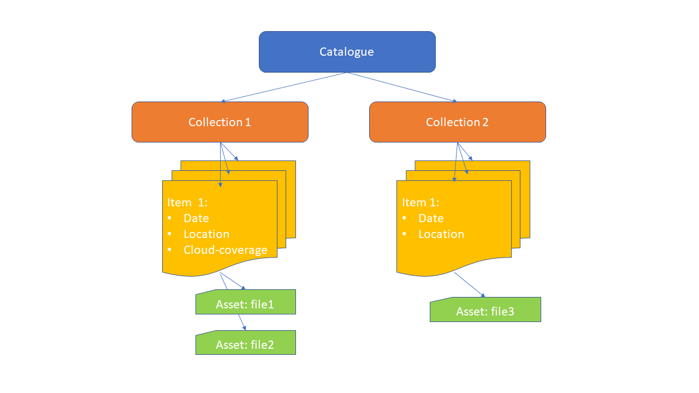

# STAC - Spatio Temporal Asset Catalogue

The [STAC](https://stacspec.org/en/) is a specification to describe geospatial information, so it can easily **searched and downloaded**. 
STAC includes metadata of datasets and links to actual files, the data files are usually stored in the cloud. 
For raster data Cloud-Optimized GeoTiff is the best option. 
STAC is most often used for raster data, but it can be used also for vector and lidar data. The most common use case is remote sensing images.

STAC main concepts:

* **Catalog** - general metadata and links to available Collections.
* **Collection** - collection specific general metadata and links to available Items. In one collection are similar items.
* **Item** - the core atomic unit, representing a single spatiotemporal asset as a GeoJSON feature plus datetime, bbox and links to data file(s).

## Static STAC and STAC API

* Static STAC - a set of linked JSON files representing each catalog, collection and item.
* STAC API - enables search of STAC Items. Not all catalogues offer STAC API, but all bigger ones usually have it.

## STAC catalogues

* [List of international STAC catalogues](https://stacindex.org/catalogs)
* First Finnish STAC: [FMI Tuulituhohaukka catalog](https://pta.data.lit.fmi.fi/stac/root.json). Only static catalogue, but includes several useful datasets.

## STAC tools
* [List of many STAC related tools](https://stacindex.org/ecosystem#/)
* Main Python packages for using STAC data in Python: [pystac-client](https://pystac-client.readthedocs.io/en/latest), [stackstac](https://stackstac.readthedocs.io/), 
[xarray](https://xarray.dev/) and [dask](https://www.dask.org/).
* End-user tools are available also for [QGIS](https://stac-utils.github.io/qgis-stac-plugin/) and [R](https://cran.r-project.org/web/packages/rstac/index.html).

## CSC examples
In this repository we provide to examples to work using Python with:
* [STAC API](stac_xarray_dask_example.ipynb)
* [Static STAC](static_stac.ipynb)
